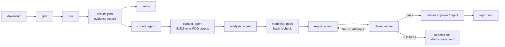

# oncocs — cohort-agnostic survival analysis with verified LLM reporting

oncocs runs reproducible survival analyses on public TCGA cohorts from
cBioPortal DataHub, then lets a local LLM *describe* the results while
deterministic code does every computation. An LLM proposes and writes the
report prose; a claim verifier binds every number in that prose to the recorded
computation — including which model each number belongs to — and a human
approval gate signs off. Every LLM call is recorded and can be replayed
byte-for-byte.

Stack: LangGraph StateGraph agents; lifelines Cox PH and scikit-survival Random
Survival Forest; BM25 retrieval over NCI PDQ; FastAPI review API; pluggable LLM
backend (Ollama gemma3 by default, any LangChain chat model, recorded
transcripts for replay).



## Results across three cohorts (seed 20240601)

| Cohort | n | Events train/test | Checks | Best Harrell C (test) |
|---|---|---|---|---|
| LUAD | 501 | 126 / 55 | all 5 passed | 0.647 — cox/clinical |
| GBM | 580 | 335 / 143 | 2 passed; all 4 models abstained | — |
| BRCA | 1071 | 106 / 45 | all 5 passed | 0.708 — cox/clinical |

- GBM has no AJCC stage in this study (`stage: null`; recorded as
  `omitted_covariates`), 49% of patients lack age/sex, and 33% are unsequenced.
  Every covariate exceeded the 20% missingness filter, so the run records a
  `covariates` check failure and all four models abstain — a legitimate result.
- BRCA adds `STAGE IIIC` / `STAGE X` source values; `STAGE X` ("stage cannot be
  assessed") stays unmapped and is counted as missing (19 patients, 1.8%).

LUAD in detail (all checks passed; references: stage I, sex Female):

| Model / features | Harrell C | Uno C | AUC 12m | AUC 24m | AUC 36m | IBS 6–36m |
|---|---|---|---|---|---|---|
| Cox / clinical | 0.647 | 0.640 | 0.649 | 0.691 | 0.694 | 0.153 |
| RSF / clinical | 0.639 | 0.639 | 0.604 | 0.675 | 0.695 | 0.153 |
| Cox / clinical + expression | 0.643 | 0.632 | 0.711 | 0.666 | 0.628 | 0.157 |
| RSF / clinical + expression | 0.632 | 0.615 | 0.671 | 0.672 | 0.609 | 0.153 |

Top clinical Cox hazard ratios: stage IV 3.27 (1.66–6.44, p=0.0006),
stage III 2.62 (1.75–3.93, p<0.0001), mut STK11 1.64 (1.06–2.53, p=0.027),
stage II 1.54 (1.06–2.24, p=0.025). Adding the top-50 variance expression genes
did not improve over clinical features; `excluded_genes` /
`excluded_gene_patterns` exist because sex-linked genes dominated the variance
ranking while sex is already a covariate.

## What the verifier caught

- **`agent/7b433c558b79` (LUAD, gemma3:4b, human-rejected):** the report's
  `rsf/clinical_expression` block listed `cox/clinical_expression`'s metrics and
  omitted `rsf/clinical`. Every number was real, so the numeric-only verifier
  passed it; a human reviewer rejected it. This run motivated scoped
  verification: numbers after a model-key mention must match that model's
  subtree (`misattributed`), and model-only numbers in unscoped text fail
  (`unscoped_model_numbers`).
- **`agent/777c93997c7a` (LUAD, gemma3:12b):** rejected — repeatedly listed
  `cox/clinical_expression` metrics (0.157, 0.711, 0.666) under `cox/clinical`.
- **`agent/ce75cc3fd75a` (GBM, gemma3:4b):** rejected — all four models
  abstained but the draft never disclosed the abstention.
- **`agent/4afbc74b7bc5` (BRCA, gemma3:12b) — verifier false positive, fixed:**
  rejected for writing the IBS window label "6-36 months" in unscoped text; the
  `6` matched only `models.*` values. The verifier now derives integers embedded
  in metric key names (e.g. `integrated_brier_6_36m`, `auc_24m`) and treats them
  as labels; the follow-up run `052fa2c286da` passed in 3 attempts.

## Model comparison (gemma3:4b vs gemma3:12b, seed 20240601, temp 0)

`results/agent_model_comparison.json` is regenerated by `oncocs agent summarize`.

| Cohort | gemma3:4b | replay | gemma3:12b | replay |
|---|---|---|---|---|
| LUAD | passed in 1 attempt (later human-rejected for misattribution) | FROZEN | rejected after 3 (persistent misattribution) | PASS |
| GBM | rejected after 3 (abstention not disclosed) | FROZEN | passed in 2 attempts | PASS |
| BRCA | passed in 1 attempt | FROZEN | passed in 3 attempts † | PASS |

† Earlier run `4afbc74b7bc5` was rejected on the "6-36" label false positive
described above. Replay proves the recorded prompts and responses reproduce
the same report and verdict under the current code; FROZEN runs predate a
prompt change and are kept as evidence, not re-verified.

More parameters did not monotonically help: 12b fixed the abstention
disclosure on GBM but introduced or retained scoped-attribution errors on the
other two cohorts.

## Quick start

```bash
pip install -e .[dev]
python -m oncocs download --cohort luad          # archive or per-file fallback
python -m oncocs split --cohort luad --seed 20240601
python -m oncocs run --cohort luad --seed 20240601
python -m oncocs verify results/luad/<run_id>/results.json

python -m oncocs rag fetch                       # NCI PDQ corpus (~92 KB)
python -m oncocs agent run --cohort luad --results results/luad/<run_id>/results.json \
    --backend ollama --model gemma3:4b --seed 20240601
python -m oncocs agent replay results/luad/<run_id>/agent/<agent_id>/agent_run.json
python -m oncocs approve <agent_run.json> --by "<name>"   # or: reject --reason "..."
python -m oncocs agent summarize                 # results/agent_model_comparison.json
python -m oncocs serve --port 8000               # review API on 127.0.0.1
```

Cohorts are config-driven (`cohorts/<id>.yaml`); adding a cohort is a yaml file,
not code. GBM and BRCA were added yaml-only; the only `oncocs/` changes between
the phase-3 start and end were generic fixes any cohort could trigger (78 lines
across 3 files: LFS-pointer detection in the download fallback, replay
comparison for rejected reports, and clean abstention when no covariates
survive missingness).

## Docker

```bash
docker build -t oncocs .
docker run -v "$PWD/results:/app/results" -v "$PWD/data:/app/data" \
           -v "$PWD/splits:/app/splits" -v "$PWD/rag:/app/rag" -p 8000:8000 oncocs
```

The container serves the review API over saved runs. The LLM backend (Ollama)
is **not** in the image; agent runs happen outside the container.

## Evidence record

Every run writes `results/<cohort>/<run_id>/results.json` containing git
commit/dirty state, data manifest hash, split hash, config hash, package
versions, missingness/drop counts, omitted covariates, check outcomes, and
per-model metrics (or abstention reasons). `oncocs verify` recomputes the
hashes and reruns the pipeline. Agent runs write
`results/<cohort>/<run_id>/agent/<agent_run_id>/{agent_run.json,report.md}` —
the full prompt transcript (replayable via `RecordedBackend`), every draft with
its verification, the analysis plan, status, and human-review metadata.

## API

`GET /cohorts`, `GET /runs`, `GET /runs/{cohort}/{run_id}`,
`GET /runs/{cohort}/{run_id}/agent`, `GET /agent/{cohort}/{run_id}/{agent_id}/report`
and `.../agent_run`, plus `POST .../approve` / `POST .../reject`
(`{by, note|reason}`; conflicts return 409). The API reads saved runs and
records human decisions only — it cannot trigger pipeline or agent runs.

## Limitations

- Research/education only. Not validated for clinical, diagnostic, prognostic,
  or treatment decisions.
- Public retrospective TCGA data; results reflect the dataset, not any clinical
  claim.
- The verifier checks number provenance and model attribution, forbidden
  phrasing, section structure, abstention disclosure, and citation integrity.
  It does **not** check the scientific correctness of prose — that is what the
  human gate is for.
- Local small-parameter models are used for drafting; failure modes observed
  include misattributed model blocks and missing abstention disclosure.

## Data and licensing

- Data: cBioPortal DataHub public TCGA PanCancer Atlas 2018 studies
  (LUAD, GBM, BRCA). Downloaded per study; manifest records per-file SHA-256.
- Context corpus: NCI PDQ summaries (U.S. public domain). Suggested citation:
  *National Cancer Institute. PDQ(R) Cancer Information Summary. Bethesda, MD:
  National Cancer Institute. Retrieved from cancer.gov.*
- Code: MIT (see LICENSE).

## Layout

```
cohorts/<id>.yaml                cohort config (study, columns, covariates, rag_docs)
data/<cohort>/{manifest.json,raw/}  raw files + sha256 manifest (raw is gitignored)
splits/<cohort>.json             frozen stratified split
results/<cohort>/<run_id>/results.json    evidence record
results/<cohort>/<run_id>/agent/<id>/     agent_run.json + report.md
rag/corpus/                      PDQ text + manifest (license, citation, sha256)
oncocs/                          package: data, models, checks, evidence,
                                 agents (graph/verifier/replay/approve),
                                 rag (fetch/retrieve), api (FastAPI review)
tests/                           offline tests (synthetic fixtures)
```
