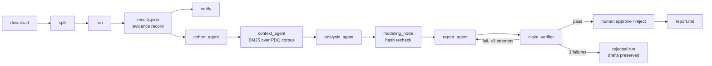

# oncocs — cohort-agnostic survival analysis with verified LLM reporting

oncocs runs reproducible survival analyses on public TCGA cohorts from
cBioPortal DataHub, then lets a local LLM *describe* the results while
deterministic code does every computation. An LLM proposes and writes the
report prose; a claim verifier binds every number in that prose to the recorded
computation — including which model each number belongs to — and a human
approval gate signs off. Every LLM call is recorded and can be replayed
byte-for-byte.

## How to read the results on this page

Two different things are evaluated here, and they have opposite outcomes.

1. **The software passes.** The deterministic survival pipeline (Cox PH, RSF,
   metrics, assumption checks) verifies and replays bit-for-bit on all three
   cohorts; the offline test suite passes (45 tests). Every number in the
   results tables below comes from that code.
2. **Gemma's written reports mostly do not pass.** After the numbers are
   computed, a local Gemma 3 model is asked only to *describe* them. Across the
   same-prompt comparison (gemma3:4b, 12b, 27b × LUAD, GBM, BRCA), the claim
   verifier rejected 8 of 9 drafts, and the one it passed (27b, GBM) was rejected
   by human review. **No report has been approved.** A red cell in the
   comparison table is the verifier catching the model, not a software failure.

What is established about the writing failure, from the preserved drafts:

- **The failure is fabrication under fluency, not arithmetic.** When handed
  real metrics, every model size wrote plausible numbers that do not exist in
  the results (e.g. 27b: Harrell C 0.688 vs computed 0.647 on LUAD; 0.728 vs
  0.708 on BRCA). The 27b model was rejected on LUAD and BRCA in all three
  attempts even though the correct values were in its prompt.
- **Scale did not fix it.** 27b's single verifier pass was on GBM, where every
  model abstained and there were no metrics to fabricate — and its prose still
  misread *why* the checks failed.
- **Smaller models added structural errors** (undisclosed abstention, metrics
  attributed to the wrong model, invented cohort size, invented citations);
  these largely disappeared at 27b while numeric fabrication did not.

What is **not** established is the mechanism inside the model — why a
transformer given the exact value 0.647 in context emits 0.688. That is a
question about the model's internals, not about this pipeline, and it is the
subject of the companion
[bioprocess-decision-runtime](https://github.com/barlowa124/bioprocess-decision-runtime)
work, which reconstructs Gemma inference layer by layer against a pinned
checkpoint. Note the gap: that work is bound to a specific Hugging Face
checkpoint and runtime, while the runs here use Ollama's quantized gemma3 GGUF
builds. Any mechanistic explanation must first be shown to apply to the model
that actually produced these drafts. Until then, this repository claims only
what it can show: the fabrication happens, it is reproducible, and it is caught.

Stack: LangGraph StateGraph agents; lifelines Cox PH and scikit-survival Random
Survival Forest; BM25 retrieval over NCI PDQ; FastAPI review API; pluggable LLM
backend (Ollama gemma3 by default, any LangChain chat model, recorded
transcripts for replay).

**2-minute tour:** [What the verifier caught](#what-the-verifier-caught) is
the headline — documented, preserved LLM failure modes (fabricated metrics,
misattributed model blocks, undisclosed abstention) caught by the
verification layer. [Results across three cohorts](#results-across-three-cohorts-seed-20240601)
has the headline survival-model numbers, and
[Evidence record](#evidence-record) describes what every run persists.



## Results across three cohorts (seed 20240601)

| Cohort | n | Events train/test | Checks | Best Harrell C (test) |
|---|---|---|---|---|
| LUAD | 501 | 126 / 55 | all 5 passed | 0.647 — cox/clinical |
| GBM | 580 | 335 / 143 | 2 passed; all 4 models abstained | — |
| BRCA | 1071 | 106 / 45 | all 5 passed | 0.708 — cox/clinical |

- GBM has no AJCC stage in this study (`stage: null`; recorded as
  `omitted_covariates`), 49% of patients lack age/sex, and 33% are unsequenced.
  Every covariate exceeded the 20% missingness filter, so the run records a
  `covariates` check failure and all four models abstain — a legitimate result.
- BRCA adds `STAGE IIIC` / `STAGE X` source values; `STAGE X` ("stage cannot be
  assessed") stays unmapped and is counted as missing (19 patients, 1.8%).

Results were regenerated at f61a25f after the config-hash scope fix; metrics
are byte-identical to the earlier run dirs, which are preserved with their
agent runs.

LUAD in detail (all checks passed; references: stage I, sex Female):

| Model / features | Harrell C | Uno C | AUC 12m | AUC 24m | AUC 36m | IBS 6–36m |
|---|---|---|---|---|---|---|
| Cox / clinical | 0.647 | 0.640 | 0.649 | 0.691 | 0.694 | 0.153 |
| RSF / clinical | 0.639 | 0.639 | 0.604 | 0.675 | 0.695 | 0.153 |
| Cox / clinical + expression | 0.643 | 0.632 | 0.711 | 0.666 | 0.628 | 0.157 |
| RSF / clinical + expression | 0.632 | 0.615 | 0.671 | 0.672 | 0.609 | 0.153 |

Top clinical Cox hazard ratios: stage IV 3.27 (1.66–6.44, p=0.0006),
stage III 2.62 (1.75–3.93, p<0.0001), mut STK11 1.64 (1.06–2.53, p=0.027),
stage II 1.54 (1.06–2.24, p=0.025). Adding the top-50 variance expression genes
did not improve over clinical features; `excluded_genes` /
`excluded_gene_patterns` exist because sex-linked genes dominated the variance
ranking while sex is already a covariate.

## What the verifier caught

- **`agent/7b433c558b79` (LUAD, gemma3:4b, human-rejected):** the report's
  `rsf/clinical_expression` block listed `cox/clinical_expression`'s metrics and
  omitted `rsf/clinical`. Every number was real, so the numeric-only verifier
  passed it; a human reviewer rejected it. This run motivated scoped
  verification: numbers after a model-key mention must match that model's
  subtree (`misattributed`), and model-only numbers in unscoped text fail
  (`unscoped_model_numbers`).
- **`agent/777c93997c7a` (LUAD, gemma3:12b):** rejected — repeatedly listed
  `cox/clinical_expression` metrics (0.157, 0.711, 0.666) under `cox/clinical`.
- **`agent/ce75cc3fd75a` (GBM, gemma3:4b):** rejected — all four models
  abstained but the draft never disclosed the abstention.
- **`agent/4afbc74b7bc5` (BRCA, gemma3:12b) — verifier false positive, fixed:**
  rejected for writing the IBS window label "6-36 months" in unscoped text; the
  `6` matched only `models.*` values. The verifier now derives integers embedded
  in metric key names (e.g. `integrated_brier_6_36m`, `auc_24m`) and treats them
  as labels; the follow-up run `052fa2c286da` passed in 3 attempts.
- **`agent/ea53fcd852c2` and `agent/5d5a01a0e471` (GBM, BRCA, gemma3:4b):**
  rejected — invented citation tags (`[PDQ:doc#0]` was not among the retrieved
  passages) and, on GBM, failure to disclose the all-model abstention.
- **`agent/4918eaf618e7` (LUAD, gemma3:4b):** rejected — described a
  concordance index as a calibration metric, then cited model-only numbers
  with no model attribution.
- **`agent/a911996a2e14` (LUAD, gemma3:12b):** rejected — fabricated a cohort
  size of 602 for a 501-patient cohort on every attempt, in addition to
  persistent metric misattribution.
- **`agent/a706c3f76993` (GBM, gemma3:4b):** rejected — after the first
  attempt was flagged for not disclosing the all-model abstention, attempts
  2 and 3 invented metric values (harrell_c = 0.45, etc.) for models that
  had abstained.
- **`agent/318d61643606` and `agent/39189caa1502` (LUAD, BRCA, gemma3:27b):**
  rejected — both drafts produced tidy metric tables whose values
  (harrell_c 0.688 / 0.728, uno_c 0.162 / 0.118) do not exist in the
  results; every attempt was flagged `unverified_numbers`.

## What human review caught

- **`agent/ba8da12d0f19` (GBM, gemma3:27b):** verifier passed (1 attempt) —
  every number verified and the abstention was disclosed — but the
  Limitations section read the `proportional_hazards` and `convergence`
  check failures as evidence the PH assumption may not hold and fitting was
  unstable; the recorded details show both were downstream of the covariates
  check. Human-rejected.

## Model comparison (gemma3:4b vs gemma3:12b, seed 20240601, temp 0)

`results/agent_model_comparison.json` is regenerated by
`oncocs agent summarize --replay`. The table compares only runs recorded under
the current prompts (all replay PASS — replay proves the recorded prompts and
responses reproduce the same report and verdict under the current code):

| Cohort | gemma3:4b | gemma3:12b | gemma3:27b |
|---|---|---|---|
| LUAD | rejected after 3 — unscoped model numbers, C-index mislabeled as calibration, unverified "significant" (`98d9952a9150`) | rejected after 3 — fabricated cohort size (602 for a 501-patient cohort), persistent misattribution (`a911996a2e14`) | rejected after 3 — invented metric values in every attempt (`318d61643606`) |
| GBM | rejected after 3 — undisclosed abstention, then fabricated metric values for the abstained models (`a706c3f76993`) | rejected after 3 — abstention never disclosed (`c654c99fa00f`) | verifier passed (1 attempt); **human-rejected** — misread check details (`ba8da12d0f19`) |
| BRCA | rejected after 3 — "robust" and unverified "significant" (`dd95bfcd2b8b`) | rejected after 3 — persistent misattribution (`14dee8f5d071`) | rejected after 3 — invented metric values in every attempt (`39189caa1502`) |

Under identical prompts, only gemma3:27b produced a verified draft, on GBM
(the all-abstained cohort) in a single attempt. The LUAD and BRCA 27b runs
were rejected for inventing metric values not present in the results table
(e.g. harrell_c 0.688 / 0.728 vs the computed 0.647 / 0.708). Across 20
recorded runs, the verifier passed 1 of 9 same-prompt drafts (gemma3:27b,
GBM) and human review rejected it; no report has been approved.

### Earlier runs (pre-prompt-change, kept as evidence)

FROZEN runs predate a prompt change and are not re-verified:

- LUAD `76a00fdba97d` (4b): passed verifier; **human-rejected** for the
  misattribution described above.
- LUAD `7b433c558b79` (4b): same semantic defect, first recorded instance.
- LUAD `4918eaf618e7` (4b): rejected — C-index mislabeled as calibration,
  then unscoped model numbers.
- LUAD `777c93997c7a` (12b): rejected — persistent misattribution.
- GBM `ce75cc3fd75a` (4b): rejected — abstention not disclosed.
- GBM `ea53fcd852c2` (4b): rejected — invented citation tags, undisclosed
  abstention.
- GBM `0fb3e28f52d6` (12b): passed verifier in 2 attempts, unapproved.
- BRCA `b81f24db3970` (4b): passed verifier, unapproved.
- BRCA `5d5a01a0e471` (4b): rejected — invented citation tag, C-index
  mislabeled as calibration.
- BRCA `4afbc74b7bc5` (12b): rejected — the "6-36" label false positive.
- BRCA `052fa2c286da` (12b): passed verifier in 3 attempts, unapproved.

## Quick start

```bash
pip install -e .[dev]
python -m oncocs download --cohort luad          # archive or per-file fallback
python -m oncocs split --cohort luad --seed 20240601
python -m oncocs run --cohort luad --seed 20240601
python -m oncocs verify results/luad/<run_id>/results.json

python -m oncocs rag fetch                       # NCI PDQ corpus (~92 KB)
python -m oncocs agent run --cohort luad --results results/luad/<run_id>/results.json \
    --backend ollama --model gemma3:4b --seed 20240601
python -m oncocs agent replay results/luad/<run_id>/agent/<agent_id>/agent_run.json
python -m oncocs approve <agent_run.json> --by "<name>"   # or: reject --reason "..."
python -m oncocs agent summarize                 # results/agent_model_comparison.json
python -m oncocs serve --port 8000               # review API on 127.0.0.1
```

Cohorts are config-driven (`cohorts/<id>.yaml`); adding a cohort is a yaml file,
not code. GBM and BRCA were added yaml-only; the only `oncocs/` changes between
the phase-3 start and end were generic fixes any cohort could trigger (78 lines
across 3 files: LFS-pointer detection in the download fallback, replay
comparison for rejected reports, and clean abstention when no covariates
survive missingness).

### Data acquisition and QC

Acquisition order (S3 archive → per-file DataHub → raw GitHub fallback →
cBioPortal API for mutations), SHA-256 manifesting, LFS-pointer detection,
harmonization, missingness filtering, and split freezing are documented in
[docs/DATA_PIPELINE.md](docs/DATA_PIPELINE.md). `oncocs qc --cohort X` audits
already-downloaded raw data and writes `results/<cohort>/<run>/qc.json`:

```
$ python -m oncocs qc --cohort luad        # abridged
QC luad: wrote results/luad/549df572c5ab/qc.json
  schema clinical_patient: OK
  schema clinical_sample: OK
  schema mutations: OK
  schema expression: OK
  missingness clinical_patient: 34 columns with missing values
  duplicates: {'clinical_patient_patient_id': 0, 'clinical_sample_sample_id': 0}
  unsequenced primary samples: 0
  split integrity: True {'hash_match': True, 'overlap_count': 0, ...}
```

Loaders validate every frame against pandera schemas (`oncocs/schemas.py`);
a malformed frame raises `SchemaError` rather than being silently coerced.

## Docker

```bash
docker build -t oncocs .
docker run -v "$PWD/results:/app/results" -v "$PWD/data:/app/data" \
           -v "$PWD/splits:/app/splits" -v "$PWD/rag:/app/rag" -p 8000:8000 oncocs
```

The container serves the review API over saved runs. The LLM backend (Ollama)
is **not** in the image; agent runs happen outside the container.

## Evidence record

Every run writes `results/<cohort>/<run_id>/results.json` containing git
commit/dirty state, data manifest hash, split hash, config hash, package
versions, missingness/drop counts, omitted covariates, check outcomes, and
per-model metrics (or abstention reasons). `oncocs verify` recomputes the
hashes and reruns the pipeline. Agent runs write
`results/<cohort>/<run_id>/agent/<agent_run_id>/{agent_run.json,report.md}` —
the full prompt transcript (replayable via `RecordedBackend`), every draft with
its verification, the analysis plan, status, and human-review metadata.

## API

`GET /cohorts`, `GET /runs`, `GET /runs/{cohort}/{run_id}`,
`GET /runs/{cohort}/{run_id}/agent`, `GET /agent/{cohort}/{run_id}/{agent_id}/report`
and `.../agent_run`, plus `POST .../approve` / `POST .../reject`
(`{by, note|reason}`; conflicts return 409). The API reads saved runs and
records human decisions only — it cannot trigger pipeline or agent runs.

## Limitations

- Research/education only. Not validated for clinical, diagnostic, prognostic,
  or treatment decisions.
- Public retrospective TCGA data; results reflect the dataset, not any clinical
  claim.
- The verifier checks number provenance and model attribution, forbidden
  phrasing, section structure, abstention disclosure, and citation integrity.
  It does **not** check the scientific correctness of prose — that is what the
  human gate is for.
- Local small-parameter models are used for drafting; failure modes observed
  include misattributed model blocks and missing abstention disclosure.

## Data and licensing

- Data: cBioPortal DataHub public TCGA PanCancer Atlas 2018 studies
  (LUAD, GBM, BRCA). Downloaded per study; manifest records per-file SHA-256.
- Context corpus: NCI PDQ summaries (U.S. public domain). Suggested citation:
  *National Cancer Institute. PDQ(R) Cancer Information Summary. Bethesda, MD:
  National Cancer Institute. Retrieved from cancer.gov.*
- Code: MIT (see LICENSE).

## Layout

```
cohorts/<id>.yaml                cohort config (study, columns, covariates, rag_docs)
data/<cohort>/{manifest.json,raw/}  raw files + sha256 manifest (raw is gitignored)
splits/<cohort>.json             frozen stratified split
results/<cohort>/<run_id>/results.json    evidence record
results/<cohort>/<run_id>/agent/<id>/     agent_run.json + report.md
rag/corpus/                      PDQ text + manifest (license, citation, sha256)
oncocs/                          package: data, models, checks, evidence,
                                 agents (graph/verifier/replay/approve),
                                 rag (fetch/retrieve), api (FastAPI review)
tests/                           offline tests (synthetic fixtures)
```
