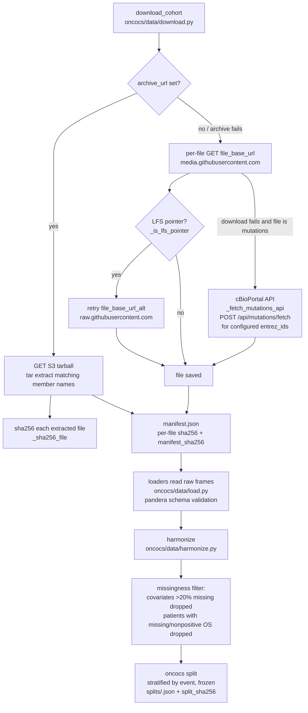

# Data acquisition and QC

How cohort data gets from cBioPortal to a frozen split, and what each check
rejects. Every claim below names the function that implements it.

## Acquisition flow

Details:

- `download_cohort(cfg, root)` prefers the configured S3 archive
  (`cfg.archive_url`), extracts only the member files named in
  `cfg.files`, and hashes each with `_sha256_file`.
- Without an archive it downloads each file from `cfg.file_base_url`
  (DataHub media CDN). `_is_lfs_pointer` detects Git LFS pointer bodies and
  triggers a retry against `cfg.file_base_url_alt` (raw.githubusercontent.com).
- If the mutation file cannot be fetched either way,
  `_fetch_mutations_api` queries `https://www.cbioportal.org/api/mutations/fetch`
  for the cohort's configured `entrez_ids` and writes a minimal MAF-style TSV.
- `cases_sequenced` (`case_lists/cases_sequenced.txt`) is loaded by
  `load_cases_sequenced`; `harmonize` uses it to mark mutation indicators as
  NaN (not 0) for patients whose samples were never sequenced.
- `harmonize(cfg, cp, cs, expr, mut, sequenced)` maps OS status through
  `cfg.os_status_map`, drops missing/nonpositive survival, restricts to
  primary samples (`cfg.sample_type_suffix`), deduplicates sample→patient
  links, maps stage via `cfg.stage_map`, builds `mut_*` indicators, pivots
  expression to patient level, and drops covariates with >20% missingness.
- `make_split` (`oncocs/splits.py`) stratifies by `event`, freezes train/test
  ids to `splits/<cohort>.json`, and records `split_sha256`
  (`split_sha256()` over sorted ids). It refuses to overwrite without
  `--force`.
- Schema validation (pandera, `oncocs/schemas.py`) runs inside the loaders:
  `load_clinical_patient`, `load_clinical_sample`, `load_mutations`,
  `load_expression` validate their raw frames; `harmonize` validates the
  harmonized survival frame via `validate_survival_frame`. Malformed frames
  raise `pandera.errors.SchemaError` — nothing is silently coerced.

## check → what it rejects → where recorded

| check | what it rejects | where recorded |
|---|---|---|
| `split_integrity` — `checks.check_split_integrity` | recomputed `split_sha256` ≠ recorded, any train/test id overlap, or >1% of split ids absent from the harmonized patient table | `results.json` → `checks[]` (`affects: all` → abstains every model) |
| `min_events` — `checks.check_min_events` | fewer than 30 events in train or 10 in test | `results.json` → `checks[]` (`affects: all`) |
| `covariates` — inline in `cli._run_pipeline` | zero covariates survived the >20% missingness filter in `harmonize` | `results.json` → `checks[]` (`affects: all`); all four models abstain |
| `proportional_hazards` — `checks.check_proportional_hazards` | lifelines PH test rejects any covariate at p < 0.01 in the clinical Cox model | `results.json` → `checks[]` (`affects: cox_clinical`) |
| `convergence` — `checks.check_convergence` | non-finite Cox `log_likelihood_` or `params_` | `results.json` → `checks[]` (`affects: cox`) |
| `leakage` — `checks.check_leakage` | recomputed train-only imputation values, top-variance gene selection, or per-gene mean/std differ from what `prepare_features` recorded | `results.json` → `checks[]` (`affects: all`) |
| hash recheck — `graph.modeling_node` (`oncocs/agents/graph.py`) | recorded `data_manifest_sha256` or `split_sha256` no longer matches files on disk at agent time | agent run `verification.hash_problems`; report renders as ABSTAINED banner |

## Inspecting a downloaded cohort

`oncocs qc --cohort luad` validates the raw frames against the schemas,
reports per-column missingness, unmapped categorical values (e.g. `STAGE X`),
duplicate patient ids, sample→patient mapping conflicts, unsequenced primary
samples, and split integrity, then writes `results/<cohort>/<run>/qc.json`.
